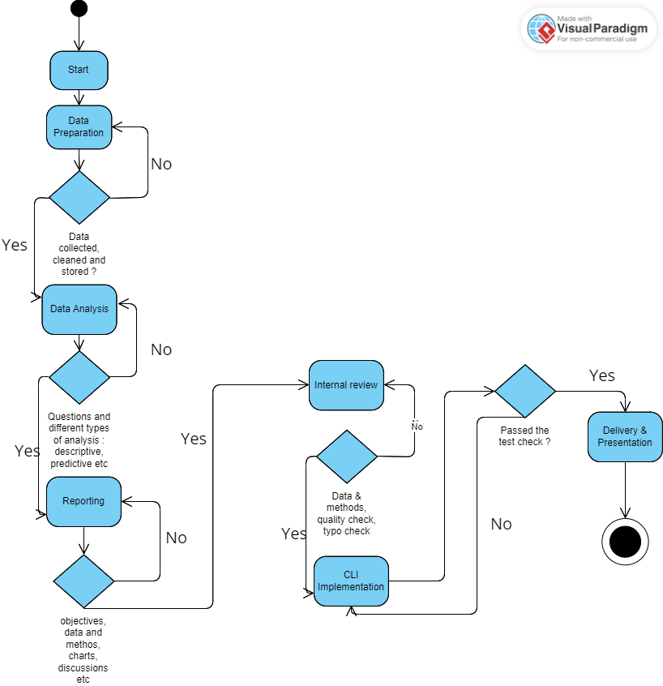
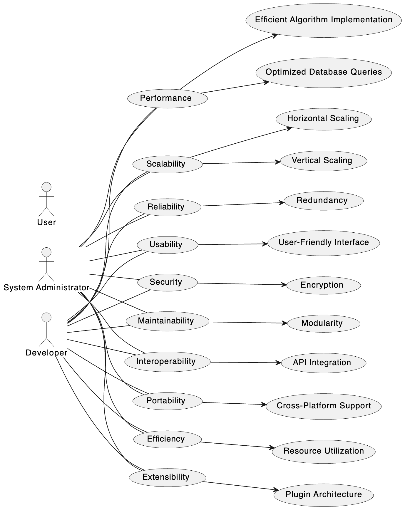

# Functional Requirements

Below is the UML Activity Diagram for the data analysis workflow:

# Non-Functional Requirements

## Performance:

- Ensure efficient data processing.
- Achieve real-time response for critical operations.

## Scalability:

- Design for flexible data handling to accommodate varying volumes.
- Implement resource allocation strategies for scalability.

## Reliability:

- Ensure fault tolerance for robust operation under adverse conditions.
- Maintain high availability to minimize downtime.

## Usability:

- Provide intuitive interfaces for ease of use.
- Ensure accessibility for users with diverse needs.

## Security:

- Implement strong data protection measures to safeguard information.
- Enforce access control mechanisms to restrict unauthorized access.

## Maintainability:

- Maintain clean and well-documented code for ease of maintenance.
- Design with modularity to facilitate future updates and enhancements.

## Interoperability:

- Enable seamless integration with external systems and data sources.
- Adhere to industry standards for interoperability and compatibility.

## Portability:

- Ensure compatibility across different platforms and environments.
- Support flexible deployment options for ease of deployment.

## Efficiency:

- Optimize resource utilization to minimize operational costs.
- Implement efficient algorithms and data processing techniques.

## Extensibility:

- Design for future scalability and adaptability.
- Provide customization options to meet evolving needs and requirements.

# Additional Considerations

- **Data Privacy**: Ensure compliance with regulations and protect sensitive information.
- **Error Handling**: Implement robust mechanisms to handle unexpected situations.
- **Documentation**: Maintain comprehensive documentation for system understanding.
- **Testing**: Conduct thorough tests to ensure system reliability.
- **Monitoring**: Implement tools to track performance and detect anomalies.
- **Scalability Planning**: Develop a roadmap for future growth.
- **User Feedback**: Gather feedback for continuous improvement.
- **Training**: Provide resources for effective system utilization.

## Non-Functional Requirements UML Diagram

